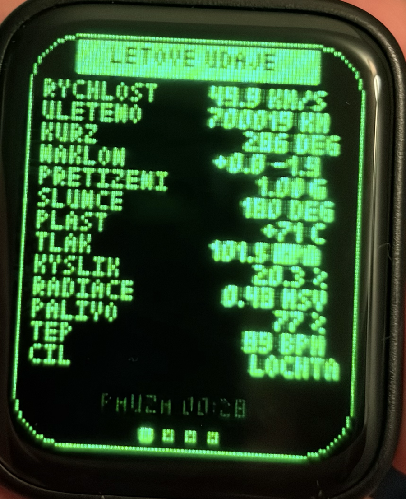
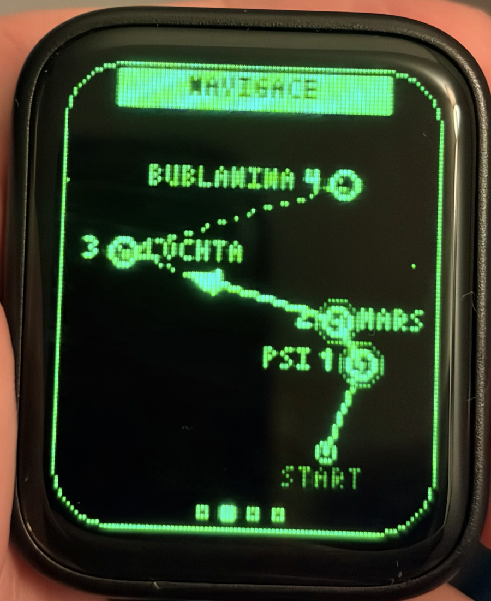
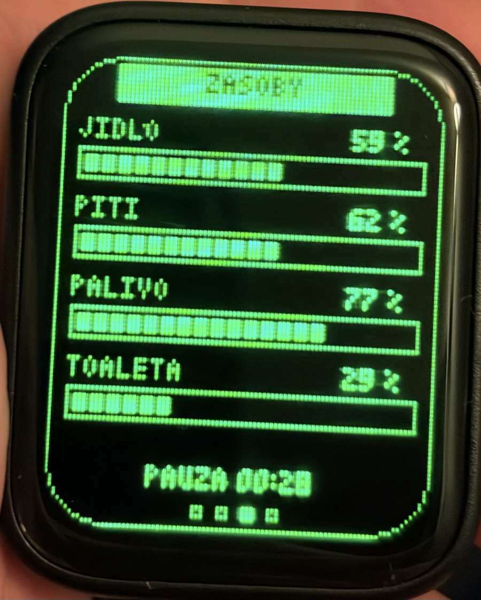
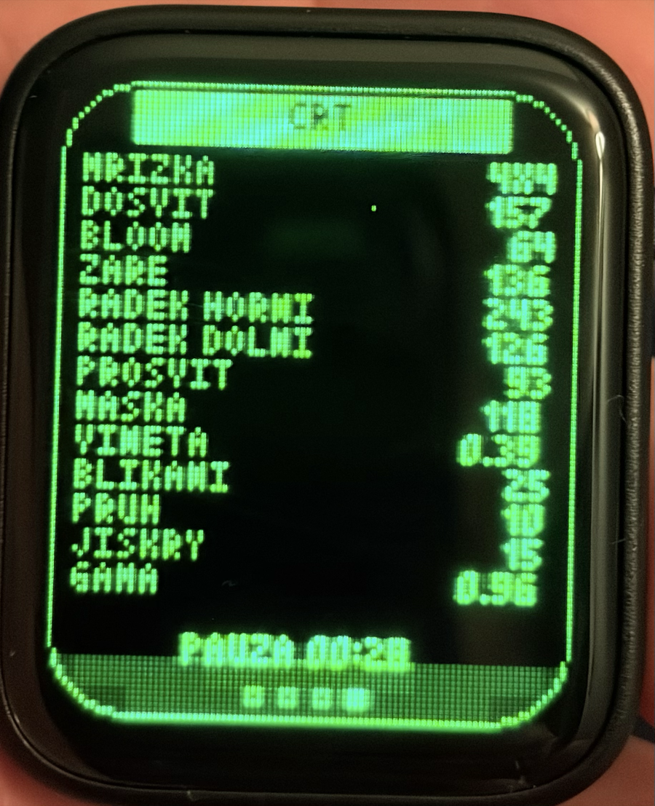

# esp32

Pokusy a hračky pro ESP32, psané v Arduino C++ (arduino-cli / Arduino IDE, esp32 core 3.x). Každé zařízení má svůj adresář a každý projekt svou kapitolu níže. Pravidla pro build a poznámky k hardwaru jsou v [`CLAUDE.md`](CLAUDE.md), větší aplikace mají vlastní specifikaci `*.md` ve svém adresáři.

Obsah:

- [Waveshare ESP32-S3-Touch-AMOLED-1.8](#waveshare-esp32-s3-touch-amoled-18)
  - [Písek](#písek--esp32-amoled-sand) · [Hvězdy](#hvězdy--esp32-amoled-starfield) · [Vodováha](#vodováha--esp32-amoled-bubble-level) · [Launcher](#launcher--esp32-amoled-launcher) · [Raketa](#raketa--esp32-amoled-ship-navigator) · [Testovací sketche](#testovací-sketche)
- [OLED SSD1351 128×128](#oled-ssd1351-128128-na-esp32)
  - [displayOnOffTest](#displayonofftest) · [finger](#finger) · [fingerRelief](#fingerrelief)
- [Build](#build) · [Licence](#licence)

---

## Waveshare ESP32-S3-Touch-AMOLED-1.8

Deska ve formátu hodinek: ESP32-S3 (512 KB SRAM, 8 MB PSRAM, 16 MB flash), AMOLED displej SH8601 368×448 px na QSPI, kapacitní dotyk FT3168, IMU QMI8658 (akcelerometr + gyroskop), audio kodek ES8311 s reproduktorem a mikrofonem, slot na microSD, tlačítko BOOT. Displej je napájený přes I2C expander XCA9554. Adresář [`ESP32-S3-Touch-AMOLED-1.8/`](ESP32-S3-Touch-AMOLED-1.8/).

Společné pro všechny aplikace:

- **Sdílený kód** v [`common/`](ESP32-S3-Touch-AMOLED-1.8/common/): `amoled_hw.h` inicializuje hardware (USBSerial, I2C s recovery zaseknuté sběrnice, expander, SPI sběrnice displeje, panel), `amoled_touch.h` čte dotyk, `amoled_app.h` je rozhraní pro moduly aplikací.
- **Modul aplikace** `<app>_app.h` s funkcemi `begin / loop / end`. Stejný modul používá samostatný sketch aplikace i launcher, kde je každá aplikace vlastní překladová jednotka, takže se nic nepřejmenovává a konfigurace nekolidují.
- **Bez PSRAM.** Všechny aplikace se vejdou do interní RAM; kreslí se buď diferenciálně, přes malé canvasy, nebo po pruzích vlastním DMA zařízením na SPI sběrnici (368×32 px, ~15 ms na celý displej).
- Knihovny: Arduino_GFX (GFX Library for Arduino), SensorLib (QMI8658), Arduino_DriveBus (FT3168), Adafruit_XCA9554, ESP_I2S.

### Písek — `esp32-amoled-sand`

Falling-sand simulace řízená náklonem zařízení. Mřížka 30×37 buněk (12 px na zrnko), gravitace je vektor akcelerometru v rovině displeje: naklonění mění směr pádu, položené zařízení simulaci zastaví. Zrnka padají, dočasně se lepí, sklouzávají do stran, po chvíli klidu zamrzají a probouzejí se, když se něco pod nimi uvolní nebo když se změní směr gravitace.

- **Ovládání:** držení BOOT sype písek od horní hrany (rychlost podle náklonu, třepání rozšiřuje sypací zónu), dotyk maže zrnka pod prstem.
- **Technika:** žádný framebuffer; překreslují se jen změněné buňky (dirty bity), souvislé úseky jedním zápisem, takže nic nebliká.
- Specifikace: [`sand.md`](ESP32-S3-Touch-AMOLED-1.8/esp32-amoled-sand/sand.md).

### Hvězdy — `esp32-amoled-starfield`

Průlet hvězdným polem: 2700 hvězd v kouli kolem oka letí pevným směrem ve světových souřadnicích a zařízení je kamera. Svisle držené vypadá jako klasický starfield, položené naplocho hvězdy proudí přes displej od hrany k hraně. Jas podle vzdálenosti, část hvězd s teplým nádechem.

- **Vstup:** akcelerometr a gyroskop v komplementárním filtru (směr gravitace), gyroskop otáčí směr letu, který se pomalu vrací k „přímo na mě"; bias gyra se měří, kdykoli zařízení chvíli leží v klidu.
- **Technika:** vlastní SPI/DMA renderer po pruzích 368×32 s ping-pong buffery, ~52 fps místo ~25 fps přes knihovnu. Na displeji si zařízení a knihovna Arduino_GFX sdílejí sběrnici i CS pin.
- Specifikace: [`starfield.md`](ESP32-S3-Touch-AMOLED-1.8/esp32-amoled-starfield/starfield.md).

### Vodováha — `esp32-amoled-bubble-level`

Kruhová vodováha jako ze stavby: černé pouzdro, zelená kapalina s radiálním přechodem, sklo s odleskem, bublina s tmavším okrajem a srpkem světla, černá referenční kružnice, vlevo nahoře číselný náklon X/Y ve stupních. Bublina plave proti gravitaci, výchylka je nelineární jako u vypouklého skla (citlivá kolem nuly).

- **Ovládání:** stisk BOOT aretuje aktuální náklon jako novou rovinu; bublina sjede do středu a údaj ukáže 0,0. Náklon se dál měří jako rozdíl úhlů os, takže je aretace přesná i při větším referenčním náklonu.
- **Technika:** statická scéna se kreslí jednou, bublina přes pohyblivý canvas 128×128 (gradient → bublina → odlesk → kružnice navrch), text přes malý canvas s omezenou frekvencí.
- Specifikace: [`bubble-level.md`](ESP32-S3-Touch-AMOLED-1.8/esp32-amoled-bubble-level/bubble-level.md).

### Launcher — `esp32-amoled-launcher`

Písek, hvězdy a vodováha v jednom firmwaru. **Dvojklik** na displej přepne na další aplikaci (písek → hvězdy → vodováha → písek); vyhodnocuje se při zvednutí druhého ťuknutí, takže nová aplikace žádný dotyk nedostane. Každá aplikace startuje načisto jako po zapnutí. BOOT patří běžící aplikaci (v písku sype, ve vodováze aretuje).

- **Technika:** launcher vlastní hardware a dotyk, aplikace jsou tři `.cpp` soubory, které jen includují moduly z původních adresářů. Po hvězdách se musí vyprázdnit DMA fronta a zneplatnit cache adresového okna knihovny (`setRotation(0)`), jinak by knihovna kreslila do posledního pruhu. Statická RAM ~158 KB z 328 KB, canvasy vodováhy se alokují jen za jejího běhu.
- Přidání aplikace = její modul + jeden řádek v tabulce `apps[]`.
- Specifikace: [`launcher.md`](ESP32-S3-Touch-AMOLED-1.8/esp32-amoled-launcher/launcher.md).

### Raketa — `esp32-amoled-ship-navigator`

Dětská palubní deska rakety ve stylu zeleného monitoru z 80. let. Let trvá minutu a je celý simulovaný; čtyři obrazovky přepínané swipem doleva/doprava dokola.

<p>




</p>

1. **LETOVE UDAJE** – tabule 15 řádků: rychlost, uletěno, kurz, náklon, přetížení, Slunce, teplota pláště, tlak kabiny, kyslík, radiace, palivo, tep posádky, cíl, zbývá. Hodnoty „tikají" 4× za sekundu jako stará telemetrie.
2. **NAVIGACE** – start a čtyři planety (kroužky s krátery, čísla, náhodná jména jako MARS, LOCHTA, BUBLANINA nebo PIKOROVA) rozmístěné náhodně při každém letu; plánovaná trasa čárkovaně, uletěná plnou čarou, raketa jako trojúhelník ve směru letu.
3. **ZASOBY** – jídlo, pití, palivo a toaleta jako segmentové grafy; rychlost úbytku se losuje při startu, při nedostatku bliká varování.
4. **CRT** – výpis parametrů filtru; ťuknutí je vylosuje, tah nahoru/dolů mění mřížku 2×2 až 6×6.

- **Ovládání:** BOOT = start letu, pauza, pokračování; po dosažení čtvrté planety nový let. Swipe doleva/doprava přepíná obrazovky.
- **CRT filtr:** scéna se kreslí do bufferu s hrubou mřížkou (výchozí 4×4 px na bod, drobný font 3×5) a při přenosu po pruzích se přidá dosvit fosforu, bloom a záře, měkká stopa paprsku, scanlines, svislé proužky masky, vinětace, blikání jasu, plovoucí pruh a jiskry. Výchozí hodnoty jsou vyladěné na zařízení, vše je v `config.h` a za běhu na čtvrté obrazovce.
- **Zvuk:** kodek ES8311 přes I2S, zvuky se syntetizují v samostatném tasku: hukot motoru podle rychlosti, start, syčení trysek při minutí planety, přistání, pípnutí pauzy.
- Specifikace: [`ship-navigator.md`](ESP32-S3-Touch-AMOLED-1.8/esp32-amoled-ship-navigator/ship-navigator.md).

### Testovací sketche

- `ESP32-S3-Touch-AMOLED-1.8-test` – ověření desky: displej, dotyk s výpisem souřadnic, bitmapa 368×448 přes celý displej.
- `motoriste-kokoti` – ukázka s bitmapou 368×448 přes celý displej.

---

## OLED SSD1351 128×128 na ESP32

Barevný 1.5" RGB OLED SSD1351 (128×128, SPI) na klasickém ESP32, knihovny Adafruit_GFX a Adafruit_SSD1351. Adresář [`128display-test/`](128display-test/).

### displayOnOffTest

Počítadlo ovládané tlačítkem. Překresluje se jen oblast s číslem přes malý buffer 128×32 (8 KB), aby displej neblikal; zbytek obrazu zůstává.

### finger

Displej je černý a jednou v každém třicetisekundovém okně se v náhodný okamžik na dvě sekundy objeví reliéfní obrázek přes celý displej. Bitmapa 128×128 RGB565 je v PROGMEM (`finger_relief.h`), vygenerovaná z PNG přes emboss filtr.

### fingerRelief

Kombinace obou: počítadlo s tlačítkem a občasný reliéfní obrázek.

---

## Build

Vše se kompiluje arduino-cli (nebo Arduino IDE se stejnými knihovnami). Pro desku Waveshare:

```sh
arduino-cli compile -b esp32:esp32:waveshare_esp32_s3_touch_amoled_18:CDCOnBoot=cdc,UploadSpeed=115200 <sketch_dir>
arduino-cli upload  -b esp32:esp32:waveshare_esp32_s3_touch_amoled_18:CDCOnBoot=cdc,UploadSpeed=115200 -p /dev/cu.usbmodem1101 <sketch_dir>
```

Kompilace trvá ~17 s, nahrání ~15 s; rychlost linky nehraje roli, deska komunikuje nativním USB. Podrobnosti (PSRAM, sdílení s Arduino IDE, známé pasti jako zaseklá I2C po reflashi, blokující USBSerial nebo cache adresového okna v Arduino_GFX) jsou v [`CLAUDE.md`](CLAUDE.md).

## Licence

MIT, viz [`LICENSE`](LICENSE).
